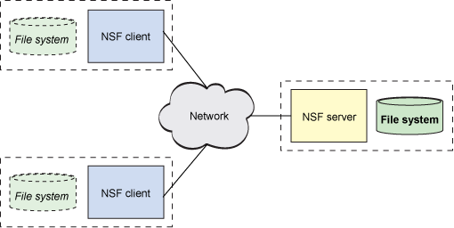

# `Network File System (NFS)` 

## Table of Contents

- [Introduction](#introduction)
- [Specifications](#specifications)
  - [1. Naming and Storage Servers](#1-naming-and-storage-servers)
  - [2. Clients](#2-clients)
  - [3. Other Features](#3-other-features)
- [Implementation Details](#implementation-details)
  - [1. Naming and Storage Servers Initialization](#1-naming-and-storage-servers-initialization)
  - [2. Storage Servers Functionalities](#2-storage-servers-functionalities)
  - [3. Naming Server Functionalities](#3-naming-server-functionalities)
  - [4. Clients Interaction](#4-clients-interaction)
  - [5. Other Features Implementation](#5-other-features-implementation)
- [Conclusion](#conclusion)
- [Bibliography](#bibliography)

## Introduction

The Network File System (NFS) is designed to facilitate efficient and seamless file operations in a distributed network environment. This report provides an overview of the NFS architecture, specifications, and key features implemented in the system.

## Specifications

### 1. Naming and Storage Servers

#### 1.1 Initialization

The initialization phase involves setting up the Naming Server (NM) and multiple Storage Servers (SS). Key steps include:

- Initializing NM and SS_1 to SS_n.
- Registration of Storage Server details with the Naming Server.
- NM starts accepting client requests.

#### 1.2 On Storage Servers (SS)

The Storage Server is a key component of a distributed file storage system. It communicates with the Naming Server and clients to manage files and directories in a distributed environment and support various functionalities such as:

- <b>Adding new storage servers dynamically:</b> 
    The Storage Server code supports dynamic addition of new servers to the distributed file storage system. The server can be started on a new machine, and upon connection to the Naming Server, it dynamically integrates into the system. This allows for scalability and the expansion of the storage infrastructure as needed.
- <b>Executing commands issued by NM (create, delete, copy):</b>
    The Storage Server listens for commands issued by the Naming Server (NM) and executes them accordingly. These commands include creating new files or directories, deleting existing files or directories, and handling file copying operations. This communication ensures that the file storage system is efficiently managed and organized based on the requirements specified by the Naming Server.
- <b>Facilitating client interactions (read, write, get size and permissions:</b>
    The Storage Server facilitates client interactions by providing functionalities for reading, writing, retrieving file size, and obtaining file permissions. Clients can request data from the server, write new content to files, and inquire about the size and permissions of specific files. This interaction enables seamless file management between clients and the distributed storage system.

#### 1.3 On Naming Server (NM)

NM performs critical functions such as:

- <b>Storing Storage Server data:</b>
    The Naming Server (NM) acts as a central repository for storing essential data related to the connected Storage Servers. It maintains information about server IP addresses, connection ports, and the accessible paths for each server. This centralized storage ensures that the NM has a comprehensive overview of the distributed file system's structure and resources.
- <b>Providing client task feedback:</b>
    The NM plays a crucial role in providing feedback to client requests and tasks. It serves as an intermediary between clients and storage servers, relaying information about the status of requested operations. This feedback mechanism enhances the communication between clients and the distributed storage infrastructure, ensuring a reliable and responsive user experience.
- <b>Providing pivotal point between storage server and client:</b>
    The NM serves as a pivotal point in the distributed file storage system, facilitating communication between Storage Servers and clients. It manages the coordination of tasks, resolves naming conflicts, and ensures that client requests are directed to the appropriate Storage Servers. This central coordination enhances the efficiency and organization of the entire distributed system.
### 2. Clients

Clients initiate communication with the NFS through the NM and interact by:

- <b>Reading, writing, and retrieving information about files:</b>
    Clients can interact with the distributed file system by initiating read, write, and retrieve operations through the Naming Server (NM). These operations involve accessing, modifying, and obtaining information about files stored across multiple Storage Servers. The NM facilitates these interactions by directing client requests to the appropriate Storage Servers based on the file paths and names.
- <b>Creating and deleting files and folders:</b>
    Clients have the capability to create new files and folders within the distributed file system. The NM plays a crucial role in managing these creation requests, ensuring that the new files and folders are appropriately allocated and stored on the designated Storage Servers. Similarly, clients can request the deletion of files and folders, and the NM ensures the proper handling of these deletion operations.
- <b>Copying files/directories between Storage Servers:</b>
    One of the key functionalities provided to clients is the ability to copy files and directories between different Storage Servers. The NM coordinates this process, determining the source and destination servers for the copy operation. This functionality enhances the system's flexibility by allowing clients to distribute and organize their data across the available Storage Servers efficiently.

### 3. Other Features

#### 3.1 Multiple Clients

Supports concurrent client access and concurrent file reading.
Supports multiple requests.
#### 3.2 Error Codes

Defines clear and descriptive error codes for effective communication of issues.
Using `perror` and `print statements` for error implementation.
The code `segementation fault` can occur after returning value from trie it can give segmentation fault.
#### 3.3 Search in Naming Servers

Efficient search using optimized data structures and LRU caching for recent searches.
Using `HASH TABLE AND QUEUE` for implementation of LRU.
Using `TRIES` for efficient search.

#### 3.4 Redundancy/Replication

Implements failure detection, data redundancy, and replication for fault tolerance.
Using TCP for `EFFICIENT` transfer of data between nm and storage servers.
Creating `copies` for storage server and using if the main `storage server fails`.

#### 3.5 Bookkeeping

Logs every request or acknowledgment, displaying relevant messages for debugging and monitoring.
Storing in `record.txt` file. `ip and port` is being stored in file for future refernces.

## Implementation Details

### 1. Naming and Storage Servers Initialization

- NM initialization includes managing directory structure and registering SS details.
- SS initialization involves sending vital details to NM.
- CLIENT initialization involves taking proper input from client basically `tokenizing` it .
### 2. Storage Servers Functionalities

- Dynamic addition of new storage servers.
- Execution of commands issued by NM (create, delete, copy).
- Handling client interactions (read, write, get size and permissions).
### 3. Naming Server Functionalities

- Central repository for critical information from SS.
- Providing timely feedback to clients.
- Sending `acknowledgements` 
### 4. Clients Interaction

- Directory mounting: NM locates the correct SS for client requests.
- Reading, writing, and retrieving information about files.
- Creating and deleting files and folders.
- Copying files/directories between SS.
- Sending acknowlegements.
### 5. Other Features Implementation

- <b>Concurrent client access:</b>
    Our NFS design supports concurrent client access to the Naming Server (NM) by employing a two-step acknowledgment process. The NM responds to client requests with an initial ACK to acknowledge the receipt of the request. To avoid blocking while processing operations, a final ACK from the relevant Storage Server (SS) is utilized. This approach ensures that the NM can handle other requests between these acknowledgments, providing a smooth experience for multiple clients.
- <b>Concurrent File Reading:</b>
    While multiple clients can read the same file simultaneously, your design enforces exclusive access for write operations. Only one client can execute write operations on a file at any given time, ensuring data consistency and integrity during write operations.
- <b>Error handling with descriptive error codes:</b>
    Our NFS design incorporates a set of clear and descriptive error codes to communicate issues between the NM and clients. These error codes cover various scenarios, such as file unavailability (non-existent files) and conflicts with ongoing write operations. This enhances communication and allows clients to understand and respond to different situations effectively.
- <b>Efficient search using optimized data structures:</b>
    To optimize the search process, the Naming Server employs efficient data structures such as Tries and Hashmaps. This minimizes response times, especially in systems with a large number of files and folders. Additionally, LRU caching is implemented to expedite subsequent requests by caching recently accessed information, further enhancing response times and overall system efficiency.
- <b>Redundancy and replication for fault tolerance:</b>
    The NFS design includes robust mechanisms for failure detection, data redundancy, and replication. The NM is equipped to promptly detect Storage Server (SS) failures, ensuring a quick response to disruptions in SS availability. Data redundancy and replication involve duplicating every file and folder in an SS across two other SS, providing fault tolerance. During SS recovery, duplicated stores are matched back to the original SS, and no new entries are added to the NM during this process. Asynchronous duplication of write commands across replicated stores ensures fault-tolerant data storage without waiting for acknowledgments.
- <b>Logging and message display for bookkeeping:</b>
    Your NFS design implements comprehensive logging and message display mechanisms. The NM records every request or acknowledgment received from clients or Storage Servers, facilitating traceability and aiding in debugging and system monitoring. The log includes relevant information such as IP addresses and ports used in each communication, enhancing the ability to trace and diagnose issues effectively. This bookkeeping ensures a transparent and accountable system operation.

## Conclusion

The NFS system has been designed and implemented with a focus on efficiency, fault tolerance, and ease of use. The architecture supports multiple clients, concurrent access, and includes features such as redundancy, replication, and error handling to enhance the overall reliability and performance of the system.

For detailed information on each specification and feature, refer to the corresponding sections in this report.

## Bibliography

1. **Resources:**
     - [Handling Multiple Clients with multi-threading](https://www.geeksforgeeks.org/handling-multiple-clients-on-server-with-multithreading-using-socket-programming-in-c-cpp/)
    - [Handling Multiple Clients without multi-threading](https://www.geeksforgeeks.org/socket-programming-in-cc-handling-multiple-clients-on-server-without-multi-threading)
     
